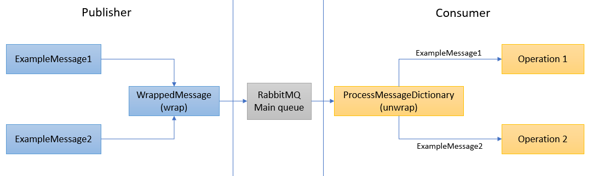

# RabbitMQ with C#
This is a reference project implementing [RabbitMQ](https://www.rabbitmq.com/) on C#, both publisher and consumer.

The project contains implementations of:
* Publishing and consuming messages
* Publishing messages and consuming them after a delay
* Publishing messages, consuming and getting the result through Remote Procedure Call (RPC)

## How to run
* Have [RabbitMQ](https://www.rabbitmq.com/download.html) installed on localhost
* Have [dotnet core](https://dotnet.microsoft.com/download) installed on the machine
* Start the consumer by running `dotnet run --project ./RabbitPoc.Consumer`
* Start the publisher by running `dotnet run --project ./RabbitPoc.Publisher`

Send messages using the web interface available on http://localhost:5000 (default), or call the API
* POST /api/send
* POST /api/send-with-response
* POST /api/send-with-delay

## Project structure

The main projects are RabbitPoc.Consumer and RabbitPoc.Publish. 

MQCommon is a support library to pinpoint which variables and methods should be the same between Consumer and Publisher, and to standardize the data structures for serialization/deserialization on all projects. It's usage is optional.

### Multiple operations inside a single queue

Bear in mind that this project was developed with the idea of publishing different messages for different operations into a single queue. **That not the default behaviour for this kind of architecture, which usually implements one queue for each kind of operation.**

